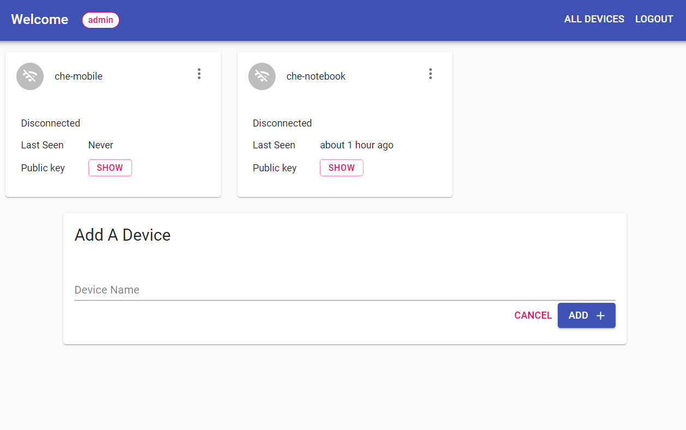
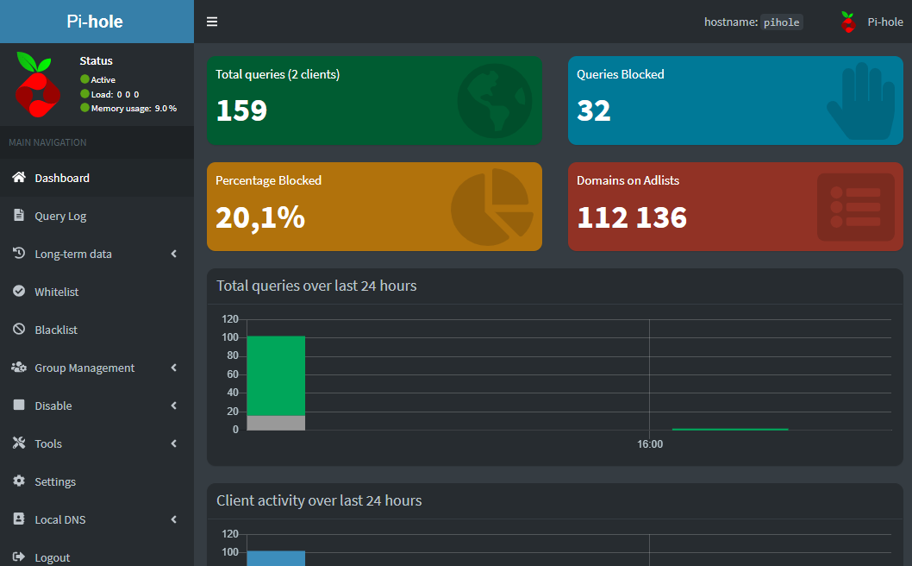

# Nika-VPN

It is an easy to deploy and use private VPN server with ad blocker.

This VPN service based on Wirehole + wg-access-server and provides a convenient and friendly installer.

1. [Wirehole](https://github.com/IAmStoxe/wirehole) - WireHole is a combination of WireGuard, Pi-hole, and Unbound in a docker-compose project with the intent of enabling users to quickly and easily create a personally managed full or split-tunnel WireGuard VPN with ad blocking capabilities thanks to Pi-hole, and DNS caching, additional privacy options, and upstream providers via Unbound.
2. [wg-access-server](https://github.com/freifunkMUC/wg-access-server) - An all-in-one WireGuard VPN solution with a web ui for connecting devices.

Winguard from Wirehole replaced with wg-access-server.

This VPN service has been developed and tesed for Oracle Cloud Free Tier on configurations:

- Canonical-Ubuntu-20.04-Minimal, VM.Standard.E2.1.Micro (amd64)
- Canonical-Ubuntu-20.04, VM.Standard.A1.Flex (aarch64)

## Installation

This script is meant for quick & easy install via:  

`curl -sSL https://bit.ly/nika-vpn-install | sh`  
or:  
`wget -qO- https://bit.ly/nika-vpn-install | sh`  

Once it ends, you need to go to `[server_public_ip_address]:[vpn_control_panel_port]` to create VPN users.

## Screenshots

### Wireguard Access Portal

### Pi-hole dashboard

## Health check

To check the correct installation and operation of Nika-VPN, use the services:

- DNS leak test - [dnsleak.com](https://dnsleak.com/) or [ipleak.net](https://ipleak.net/)
- Сheck ad blocking - [canyoublockit.com](https://canyoublockit.com)

## TODO

- [ ] Obfuscate VPN traffic with Shadowsocks or WebSocket Tunneling
- [ ] Secure traffic via tls (https) and use ODIC authorization for Wireguard Access Server using Traefik and Authelia
