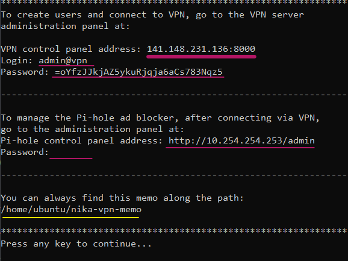

## Nika-VPN

It is an easy to deploy and use private VPN server with ad blocker.

This VPN service based on Wirehole + wg-access-server.

1. [Wirehole](https://github.com/IAmStoxe/wirehole) - WireHole is a combination of WireGuard, Pi-hole, and Unbound in a docker-compose project with the intent of enabling users to quickly and easily create a personally managed full or split-tunnel WireGuard VPN with ad blocking capabilities thanks to Pi-hole, and DNS caching, additional privacy options, and upstream providers via Unbound.
2. [wg-access-server](https://github.com/freifunkMUC/wg-access-server) - An all-in-one WireGuard VPN solution with a web ui for connecting devices.

Winguard from Wirehole replaced with wg-access-server.

This VPN service has been tested and developed for Oracle Cloud Free Tier (ARM64 ubuntu).

I also want to express gratitude to the project [Nyr/wireguard-install](https://github.com/Nyr/wireguard-install) whose developments I used to create the installation script.

### Installation

Run the script and follow the assistant:

`wget https://bit.ly/nika-vpn-install -O nika-vpn-install.sh && sudo bash nika-vpn-install.sh`

Once it ends, you need to go to [server_public_ip_address:vpn_control_panel_port] to create VPN users.

### Screenshots

### Installation completion screen

#### Wireguard Access Portal

#### Pi-hole dashboard

### Health check

To check the correct installation and operation of Nika-VPN, use the services:

- DNS leak test - [dnsleak.com](https://dnsleak.com/) or [ipleak.net](https://ipleak.net/)
- Сheck ad blocking - [canyoublockit.com](https://canyoublockit.com)
